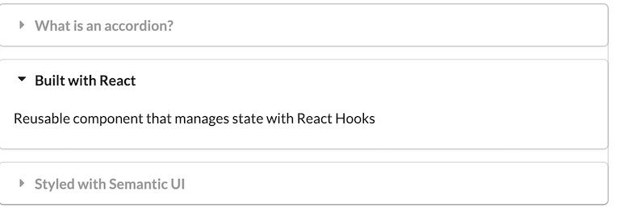
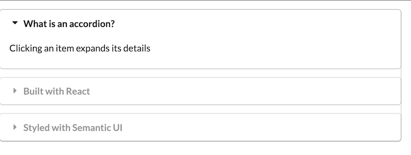

First React Hooks Project

Use of React Hooks to build reusable components.

Accordion Component - shows only one item at a time. When one item is clicked, the details about it are expanded while the details about the previously open item is collapsed. Accordion component keeps track of this piece of state with react hooks. Accordion component can be reused for a large list of information.

Styling: Semantic-ui React Accordion --> https://react.semantic-ui.com/modules/accordion/

Non-reusable example: The semantic-ui example is without a reusable component, where all the content is coded out for every single item --> https://react.semantic-ui.com/modules/accordion/#types-styled

